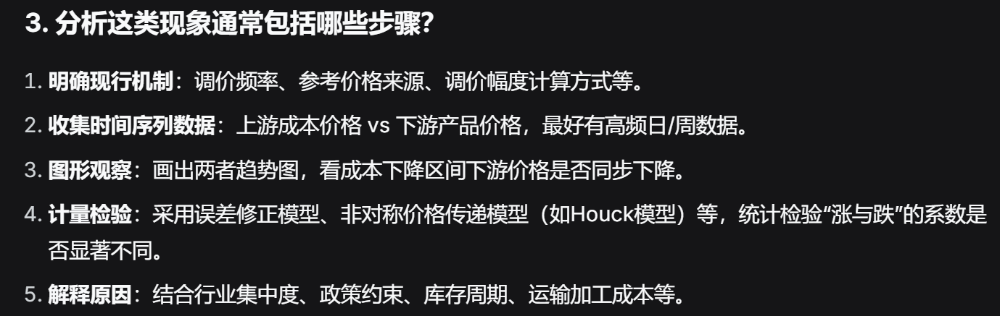

## [政府公告](https://www.gov.cn/zhengce/202604/content_7064981.htm)
> 当前国内成品油价格机制主要依据是2016年国家发展改革委印发的《石油价格管理办法》

## [石油价格管理办法](石油价格管理办法.pdf)

### 机制
- 区分**原油**和**成品油**
  - 原油: 未加工的原始油
  - 成品油: 原油加工后的产品
    - 汽油, 柴油
    - 航空煤油
    - 燃料油
    - 石脑油
    - 润滑油, 沥青, 液化石油气...
- 区分供应 - 批发 - 零售价格
- 汽油柴油的 **三价**(向社会; 铁路和交通批发) 实行 **政府指导价**
- 汽油柴油的 **批发价**(向国家; 新疆生产建设兵团) 实行 **政府定价**
- 汽油柴油的 **最高零售价格** 挂钩 **国际市场原油**, 并加权 **国内平均加工成本**, **税金**, **合理流通环节费用**, **利润**.
  - 税种研究
    - 消费税(汽油 1.52元/升，柴油 1.2元/升)
    - 增值税(税率13%, 计算基数为“价格+消费税”)
    - 城市维护建设税(税率7%, 计算基数为增值税+消费税)
    - 教育费附加(税率:3% + 2%(地方教育附加), 计算基数:增值税+消费税)
  - 合理流通环节费用研究
    - 实物流转的硬成本
      - 运输费
      - 仓储费
      - 管理费
      - 自然损耗
    - 批发/零售环节的固定价差
      - 成品油生产企业 -> 社会批发企业 的最高供应价格=最高零售价格-400(/吨)
      - 批发 -> 零售 的最高批发价格=最高零售价格-300(/吨)
  - 国内平均加工成本
    - 最低 -> 东石化(345元/吨)
- 原油价格的计算依据
  - 国际价格 <= 40$
    - 计原油价格为40$/桶
    - 正常加工利润率
  - 40$ < 国际价格 <= 80$
    - 正常加工利润率
  - 国际价格 > 80$
    - 扣减加工利润率, 直至0利润
  - 国际价格 > 130$
    - 财政支持
- **汽油柴油价格** 挂钩 **国际原油**, 10d调整一次
- 调价幅度最小为50t, 累积.
- 当调幅过大, 可申请降低调幅

## 信息源
- ...

## 问题回溯
### 任务1
> 基于公开数据，构建能够模拟现行定价机制的理论模型，并用历史数据验证模型的准确性。  
> 在此基础上，分析现行机制在实际调价过程中是否存在价格传递不对称现象，以及机制在不同国际油价区间内的表现特征。  

### 任务一核心诠释
- 公开数据 -> 构建模型(拟合现行定价机制) -> 回测
- 异常现象
  - **原油成本**发生变化后，**汽油**/**柴油**在涨价与降价时，调整的速度、幅度或时机不一致
    - 涨快跌慢:上游成本上涨时，下游产品迅速或超额涨价；成本下降时，却迟迟不降价或降幅不足。
    - 涨多跌少: 涨价幅度超过成本上升幅度，降价幅度小于成本下降幅度。

- "异常现象在**不同国际油价区间**内的表现特征" 的诠释
  - 在国际油价处于不同水平（比如很低、中等、很高）时，这种“涨快跌慢”的程度和方式是否相同？

### 任务二
> 任务二：最优动态调价策略的建模与求解   
将成品油定价问题视为一个动态决策问题。在国际油价随机波动的环境下，政府需要在每次调价窗口决定实际调价幅度（可以低于理论值）。请设计定义“社会总福利损失”函数，该函数可考虑以下因素:
>- 消费者（居民出行、物流运输等）的福利变动；   
>- 炼油企业的合理利润保障；  
>- 油价波动对国内通货膨胀（CPI）的影响；  
>- 价格过度波动对经济预期的冲击；  
>- 能源安全与供应稳定性  
> 
> 在合理的约束条件下，设计动态优化模型，求解理论上最优的调价策略，并与现行机制进行多维度比较。  
### 任务二核心诠释
- 让我们建立一个 **最优的** **动态的** 调价策略.
- 成品油定价问题 -> 动态决策问题
  - 动态决策问题:
- 设计 "**社会总福利损失**" 函数
  - 什么是 **社会总福利损失** 函数? -> 推测为**理论零售价**与**真实零售价**之间的差距, 即为社会福利所付出的, 由企业与政府承担的损失(保障民生, 体现在零售价的差距上)
  - f = f(零售价, 油企利润, 通胀, 经济预期, 供应量)
    - 消费者福利应在某个区间?
    - 油企利润应在某个区间?
    - 需考虑通胀, 即人民币可能贬值
    - 需引入经济预期因子, 其大小代表市场的预期值高低(正比or反比)
    - 需明确供应量有一个下限, 再怎么样企业也必须生产以维持国家运行
- 设计 **动态优化模型**(类比深度学习的自动微分机, 动态调整参数)(与社会总福利损失函数区分, 猜测这里的优化是为了动态调节该函数)
- "并与现行机制进行多维度比较"

### 任务三
> 任务三：简化规则提取与鲁棒性检验  
> 动态优化得到的策略可能较为复杂，难以直接向公众解释和执行。请尝试从最优策略中提取出简洁、透明、可操作的规则。同时，检验该规则在国际油价波动特性存在不确定性时的鲁棒性。基于你的分析，对中国成品油价格调控机制的改进提出具体建议。

### 任务三核心诠释
- 简化最优策略模型(核心要求:简洁, 透明, 可操作)
- 检验鲁棒性(国际油价波动不确定为前提)
- 提出改进建议

### 数据说明
> 参赛团队需自行收集所需数据。以下列出可能用到的数据类型及来源方向，但不仅限于此：  
> 国际原油价格：如布伦特、WTI、OPEC一揽子等品种的日度或周度价格数据。可参考EIA、世界银行商品价格数据库、Wind等。  
> 国内成品油价格：国家发改委历次调价公告（调价时间、幅度、调整后限价）。可参考发改委官网及行业资讯网站（如卓创资讯、隆众资讯）的汇总表。  
> 原油进出口数据：中国月度原油进口量、进口金额、进口均价。可参考海关总署在线查询系统。  
> 宏观经济数据：CPI、PPI等月度数据。可参考国家统计局官网。   
> 数据的时间范围建议至少覆盖2016年现行机制实施至今，鼓励收集更长时间序列以增强模型可靠性。  

### 数据说明核心诠释
- 数据源
  - 国际原油价格
    - 包含
      - 布伦特(英国/挪威)
      - WTI(美国)
      - OPEC一揽子(中东, 主要进口源)
    - 来源
      - OPEC(也是数据源)
      - EIA(美国, 免费)
      - 世界银行商品价格数据库(免费)
      - Wind(付费)
  - 国内成品油价格
    - 包含
      - 国家发改委历次调价公告(调价时间, 幅度, 调整后限价)
    - 来源
      - 发改委官网
      - 行业资讯网站
        - 卓创资讯
        - 隆众资讯
  - 原油进出口数据
    - 包含
      - (中国月度原油)进口量
      - 进口金额
      - 进口均价
    - 来源
      - 海关总署在线查询系统
  - 宏观经济数据
    - 包含
      - CPI
      - PPI
    - 来源
      - [国家统计局官网](https://data.stats.gov.cn/dg/website/page.html#/pc/national/home)(路径：月度数据→价格指数)
        - 同比: 同一个时期(去年四月-今年四月)
        - 环比: 临近区间(今年四月-今年五月)
- 数据要求
  - 时间: 2016-今
  - 鼓励: 收集更长时间数据

### 附录
